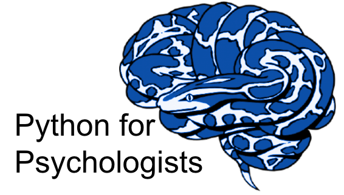

## "What's in this repository?"

This repository contains the course contents for the "Python for Psychologists" lectures conducted within the Psychology Master programme at Goethe-University Frankfurt.

We've tried to document the various aspects of this course with a whole bunch of README files, so feel free to jump around and check things out

## "I have some questions..."

[Open an issue]() on this repository and someone will try and get back to you as soon as possible!
